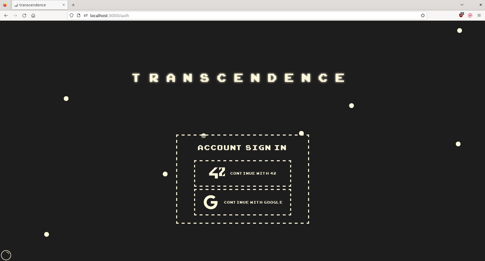
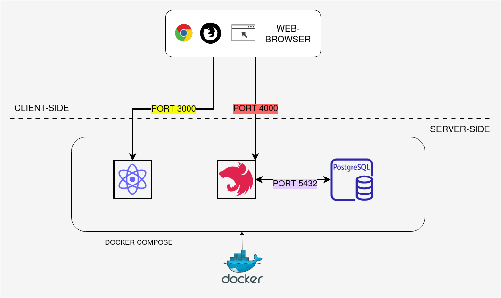
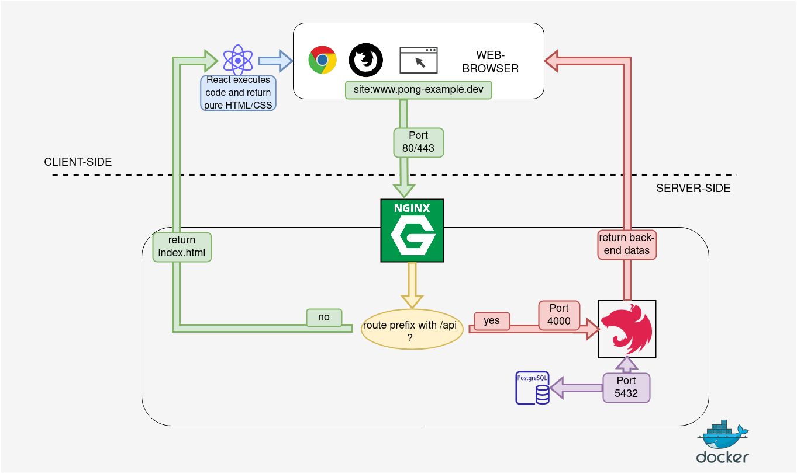
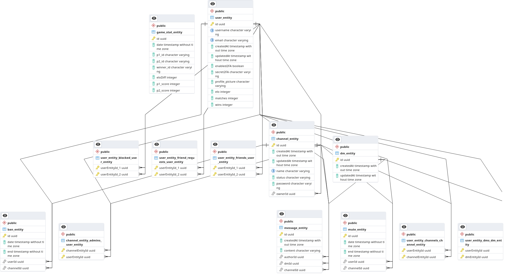
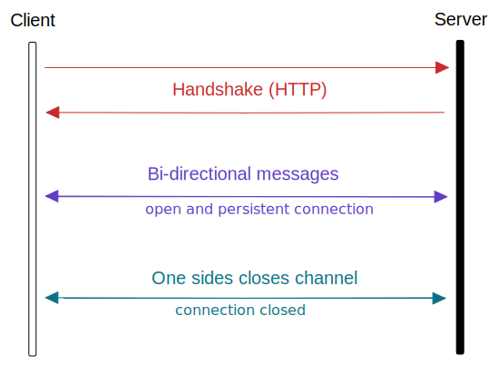

# Transcendence WebApp

We are Guillaume, Theo, Dov and Philippe and this README explains what we did to make this project happend. Let's go 🚀

<p align="center">
  
</p>

## Try it Yourself

1. Clone this repository with `git clone git@github.com:tsannie/transcendence.git`
1. Make sure you have `docker` installed on your machine
2. use the makefile with the `make` command
3. after a few seconds launch your browser and type [http://localhost:3000](http://localhost:3000) to access the WebApp. It might need a little time to deploy, so don't hesitate to refresh the page.
4. enjoy it !

## Features

- **Multiplayer mode** : play in real time against other players online in a Pong game, thanks to websockets. [Socket.io](http://socket.io/).
- **SSO Auth** : connect to your 42 or Google Account and access your game stats and your profile parameters. 2FA is available.
- **Instant chat** : chat with other players in a private message or in channels with multiple users.
- **Game profile** : check your game stats, such as number of played games, victory rate, E.L.O score, ranking against other players, using a PostgreSQL database to store those datas.

## General

The aim of this project was to construct a __fullstack webapp__ based on the classic first-ever videogame : __Pong__. 

The game, is really just a pretext to make us work on everything that revolves around the build of a webapp, such as :  

- establishing an architecture 🏗️
- code as a group 🧑🏻‍💻👨‍💻👨🏻‍💻🧑🏽‍💻
- receive and create complex HTTP requests and responses
- manage and edit a database
- connect users through websockets
- secure access to site and datas in database ⚔️
- and many more...

> let's now review how we tackled all these challenges

***

## The Stack

<br />
<br />

- __Typescript__ instead of Javascript to manage compilation error during development time and not at runtime. It also allowed us to use `enum`, `interfaces`, `null checking`.

- __React__ seemed a fairly good choice : it is one of the most used languages for front-end web developping right now.

- __NestJs__, as it is a really well made and documented framework. 

- __TypeORM__ was kind of a default choice and suggested by **NestJs**' tutorial. To be fair the typeorm documentation is pretty erratic and raises a lot of questions, that only got answered by looking at pending/closed Pull Requests or Issues on TypeORM's GitHub. We heard about __prismaORM__ or __mikroORM__ later, but it was too late...

- __CSS__ was extensively used to build our site identity. Every animations, or looks is based on it.

***

## Deployment


<br />
<br />

To run, this project relies on **Docker** and uses 3 micro-services, contained in 3 differents docker container :

1. _PostgreSQL_
2. _NestJs_
3. _ReactJs_

We also used 2 additional micro-services, for developpment mode only (not shown in the diagram) :

4. __PGadmin__, to monitor datas in our database
5. __ngrock__, to test our webapp over the internet

<br />

> This is the configuration and architecture we used during development... :



<br />

> ...but for production we are using this kind of setup, through an nginx reverse proxy :



As you can see, only port __80__ and __443__ are accessible.
Nginx act as a reverse proxy. It forwards the request to nestjs if the patern `/api` is detected :

 > HTTP request to  `www.example.com/api/user/create` would be translated into an internal request to `nestjs:4000/api/user/create`

***

## The Code

### backend-wise

these were the main topic we had to compose with : 
- [database/entity management](#database)
- [channels - chat](#channels-and-chat)
- [game development](#game-development)
- [encryption](#hashing-and-encryption)
- [data filtering](#data-safety-and-serialization)
- JWT token
- authentification / 2FA
- [websockets](#websockets)

### frontend-wise

...and these were the ones we had to compose with, frontend-wise :
- CSS animations
- routing/navigation
- notifications

## Database

We used **typeorm** to manage and edit our postgresql database. 

The library sounded pretty solid at first but we discovered, through usage, that the documentation lacked a lot of useful informations, that were only findable in pull requests of the project on Github or in the changelogs of the project...

Nevertheless, we managed to get the most out of typeorm, and to always load the **minimum** amount of needed relations to avoid slow and crappy database access.

> Here is a visualizer of our database, with relations : 



## Channels and Chat

Here is the channel entity that contains all the information that exists in a channel. Chat is pretty similar, as is it just a channel with 2 users, without possibility to block, mute, add a password to the conv etc,etc... 

``` javascript
@Entity()
export class ChannelEntity {
  @PrimaryGeneratedColumn('uuid')
  id: string;

  @CreateDateColumn()
  createdAt: Date;

  @UpdateDateColumn()
  updatedAt: Date;

  @Column({ nullable: false, unique: true })
  name: string;

  @Column({ nullable: false })
  status: string;

  @Exclude()
  @Column({ select: false, nullable: true })
  password: string;

  @ManyToOne(() => UserEntity, (user) => user.owner_of)
  owner: UserEntity;

  @ManyToMany(() => UserEntity, (user) => user.admin_of)
  @JoinTable()
  admins: UserEntity[];

  @ManyToMany(() => UserEntity, (user) => user.channels)
  users: UserEntity[];

  @OneToMany(() => MessageEntity, (message) => message.channel)
  messages: MessageEntity[];

  @OneToMany(() => MuteEntity, (mute) => mute.channel)
  muted: MuteEntity[];

  @OneToMany(() => BanEntity, (ban) => ban.channel)
  banned: BanEntity[];
}
```

There are many **endpoints** available through API requests, at the following route (dev environment) :
`http://localhost:4000/channel/<ACTION>`
such as :
- `/addPassword`
- `/create`
- `/join`
- `/delete`
- `/banUser`
- etc...

Some of our **nestjs controllers** in this project also uses **websocket** to provide instantaneous data actualization. 

This is the case here, as it allows us to communicate to connected users that the list of channel members has been actualized or that this or that member leaved the channel for example.

## Hashing and Encryption

Data protection is **primary**. Throughout this project we learned the differences between _hashing_ and _encryption_.

- **Hashing** wasn't very much intervening in our project, since we used external APIs to connect our user (Google or 42's intra). Still, we used it to safely store channel password in the database.

- end-to-end **Encryption** wasn't used : it seemed a bit overkill for small conversations in a pong game. It would've been implemented in another context.

We used `bcrypt` to hash our datas, store and compare them safely in our db. No password can be read if database is compromised.

## Game Development

The game is a multiplayer game based on **the classic Pong** that allows two players to play against each other in real-time. The goal of the game is to score more points than your opponent by hitting the ball past their paddle. The game ends when one player reaches 10 points.

To build the game, we used HTML5 canvas to render the game board and handle user mouses. We used websockets, specifically Socket.io, to enable real-time multiplayer gameplay and typescript to handle the game logic.

In addition to the game itself, we also implemented a game profile feature that allows users to view their game stats, such as the number of games played, victory rate, and ranking against other players. This information is stored in a PostgreSQL database.

### There are two different games
- The first one is based on **the classic Pong game**.
- The second one is a **trancendence** version on the game with a **new map**, square **smasher** ball that makes the ball go faster and a new **wall** that is randomly generated on the map to make the game more challenging. 

<p float="right">
  
  
</p>

### In the menu game window
 - There is two buttons, one to play the **CLASSIC Pong game** and the other to play the **TRANSCENDENCE** version of the game.
 - There is a **AMICAL** system that allows players to play against each if they are friends.
 - The **CURRENT** window that shows the games that are currently played by other players on the website.


## Data Safety and Serialization

We learned about **serialization** in nestjs documentation.

It allowed us to load an entity with sensitive datas server-side, exploit these sensitive datas, and send back the same instance of the loaded entity without sending back the sensitive fields. 

For example, I want to load a Channel Entity with all its users. The problem is that, by doing so, typeorm also loads the datas such as : 
- user's *email*
- its *2FA secret*
- its *blocked users*
- and more...

We can easily see why this is bad, and why these informations shouldn't be accessed by the client.

``` javascript
@Entity()
export class UserEntity {
  @Expose({ groups: ['user', 'me'] })
  @PrimaryGeneratedColumn('uuid')
  id: string;

  @Expose({ groups: ['user', 'me'] })
  @Column({ unique: true })
  username: string;

  @Expose({ groups: ['me'] })
  @Column({ unique: true })
  email: string;

  @Expose({ groups: ['me'] })
  @Column({ default: false })
  enabled2FA: boolean;

  @Exclude()
  @Column({ nullable: true })
  secret2FA: string;
```

With the `@Exclude`, we are sure that only the requester get access to his own email (`groups: ['me']`), and that **NO ONE** get access to the secret2FA string, explaining the empty `@Exclude()` rule.

## Websockets

### Definition:

WebSockets is a protocol for providing bi-directional, full-duplex communication channels over a single TCP connection. This allows for real-time communication between a client (such as a web browser) and a server.

In the case of private messaging, they can be used to establish a secure and persistent connection between two parties, allowing them to send and receive messages in real time.

In the case of chat in channels, they can be used to broadcast messages to all users connected to a particular channel, allowing for real-time, multi-user communication.

They are particularly useful for these types of applications because they allow for efficient and low-latency communication.

### What library i used ?

We used **Socket.IO** for this project.

**Socket.IO** is a JavaScript library that allows for **real-time**, **bi-directional** communication between web clients and servers.

We used it because it provides an easy-to-use API that makes it simple to establish and maintain WebSocket connections.

### Architecture

<p align="center">
  
</p>

</br>
</br>
</br>
</br>


***

# EXTERNAL SOURCES
https://theophile-ordinas.fr/javascript-seo-ssr-ou-csr/ (ssr ou csr ?)

https://fr.wikipedia.org/wiki/Representational_state_transfer api rest

https://medium.com/@gausmann.simon/nestjs-typeorm-and-postgresql-full-example-development-and-project-setup-working-with-database-c1a2b1b11b8f typeorm pg

https://www.digitalocean.com/community/tutorials/react-axios-react-fr axios (faire des requetes pour react a nest)

https://www.arubacloud.com/tutorial/how-to-make-http-requests-with-axios-and-reactjs.aspx req react to nest

https://developer.mozilla.org/fr/docs/Web/JavaScript/A_re-introduction_to_JavaScript doc js incr

https://fr.reactjs.org/docs/hello-world.html doc react incr

https://www.postgresqltutorial.com/postgresql-administration/psql-commands/ doc cmd postgre

https://levelup.gitconnected.com/how-to-create-a-nestjs-app-with-authentication-c0ae845ff6ac auth

https://progressivecoder.com/how-to-implement-nestjs-jwt-authentication-using-jwt-strategy/ jwt

https://react.semantic-ui.com/ template d'elements html avec react

https://www.newline.co/@bespoyasov/how-to-use-react-hook-form-with-typescript--af5ca316 form react

https://blog.logrocket.com/persistent-login-in-react-using-refresh-token-rotation/ react

https://fr.wikipedia.org/wiki/OAuth#:~:text=OAuth%20est%20un%20protocole%20libre,%C2%AB%20d%C3%A9l%C3%A9gation%20d'autorisation%20%C2%BB. OAuth

https://www.passportjs.org/packages/passport-42/ passeport42

https://circumicons.com/ icon

